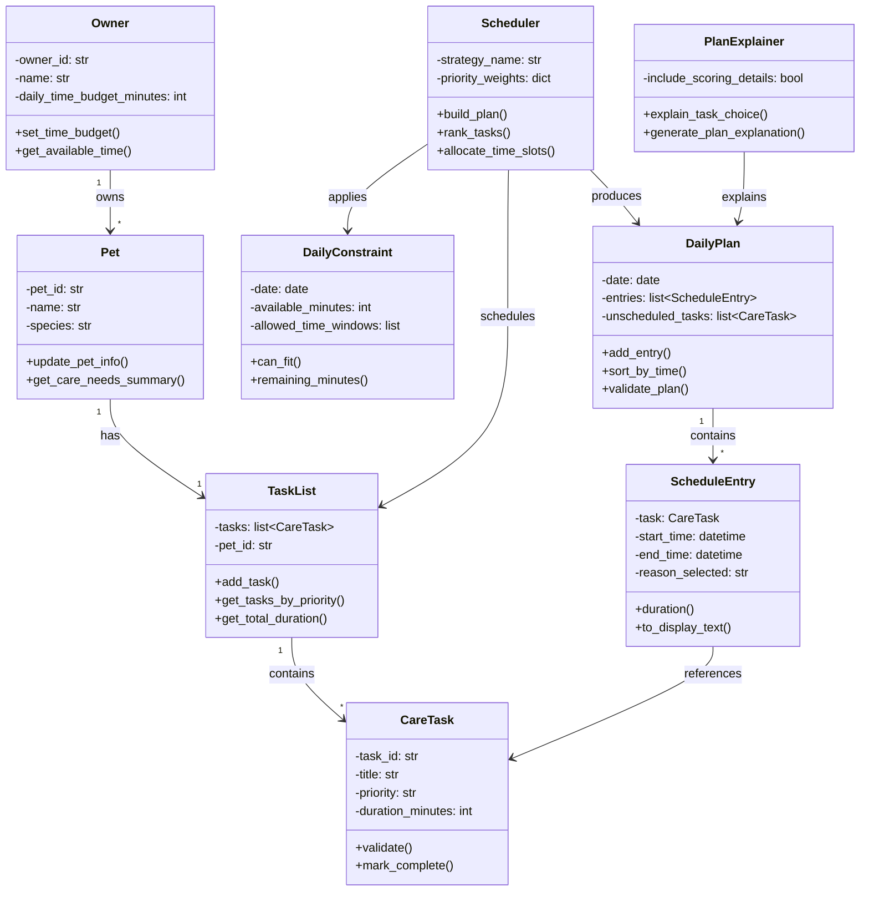

# PawPal+ UML Class Diagram

This is the simplified UML diagram showing all 9 classes and their relationships.

## Mermaid.js Code

## How to Use

- **In VS Code:** Copy the mermaid code and preview with the Markdown Preview or Mermaid extension
- **Online:** Paste into [Mermaid Live Editor](https://mermaid.live)
- **In Documentation:** Include the code block in markdown files

## Key Relationships

| Relationship | Cardinality | Meaning |
|--------------|-------------|---------|
| Owner → Pet | 1 to many | One owner can have multiple pets |
| Pet → TaskList | 1 to 1 | Each pet has exactly one task list |
| TaskList → CareTask | 1 to many | Task list contains multiple tasks |
| Scheduler → DailyPlan | 1 to 1 | Scheduler produces a daily plan |
| DailyPlan → ScheduleEntry | 1 to many | Plan contains multiple scheduled entries |

## Class Layers

**Layer 1 - Profile Management:** Owner, Pet
**Layer 2 - Task Management:** CareTask, TaskList
**Layer 3 - Scheduling:** DailyConstraint, Scheduler
**Layer 4 - Output:** DailyPlan, ScheduleEntry, PlanExplainer
