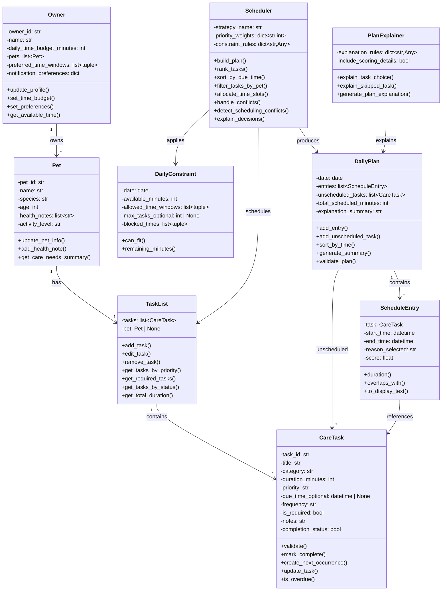

# PawPal+ Final UML Class Diagram

This is the updated UML diagram reflecting the final implementation of all 9 classes and their relationships, including new methods and attributes.

## Mermaid.js Code

## Updates from Original Design

### Owner
- **New attributes:** `pets` (list), `preferred_time_windows`, `notification_preferences`
- **New methods:** `set_preferences()`, `update_profile()`

### Pet
- **New attributes:** `health_notes` (list), `activity_level`
- **New methods:** `add_health_note()`

### CareTask
- **New attributes:** `due_time_optional`, `frequency`, `is_required`, `notes`, `completion_status`
- **New methods:** `create_next_occurrence()`, `update_task()`, `is_overdue()`
- **Behavior:** Recurring task support (daily, weekly, as-needed)

### TaskList
- **Changed:** `pet_id` (str) → `pet` (Pet | None reference)
- **New methods:** `edit_task()`, `get_required_tasks()`, `get_tasks_by_status()`

### ScheduleEntry
- **New attributes:** `score` (float)
- **New methods:** `overlaps_with()`

### DailyPlan
- **New attributes:** `total_scheduled_minutes`, `explanation_summary`
- **New methods:** `add_unscheduled_task()`, `generate_summary()`
- **Relationship:** Explicit link to unscheduled CareTask objects

### Scheduler
- **New attributes:** `constraint_rules` (dict)
- **New methods:** `sort_by_due_time()`, `filter_tasks_by_pet()`, `handle_conflicts()`, `detect_scheduling_conflicts()`, `explain_decisions()`
- **Functionality:** Enhanced algorithmic logic for intelligent task ranking and conflict detection

### PlanExplainer
- **New attributes:** `explanation_rules` (dict)
- **New methods:** `explain_skipped_task()`

## Key Relationships
- **Owner** manages **Pet**(s) — 1-to-many relationship
- **Pet** has **TaskList** — 1-to-1 relationship
- **TaskList** contains **CareTask**(s) — 1-to-many relationship
- **Scheduler** processes **TaskList** and applies **DailyConstraint** to produce **DailyPlan**
- **DailyPlan** contains **ScheduleEntry**(s) and unscheduled **CareTask**(s)
- **ScheduleEntry** references specific **CareTask**
- **PlanExplainer** generates explanations for **DailyPlan**
